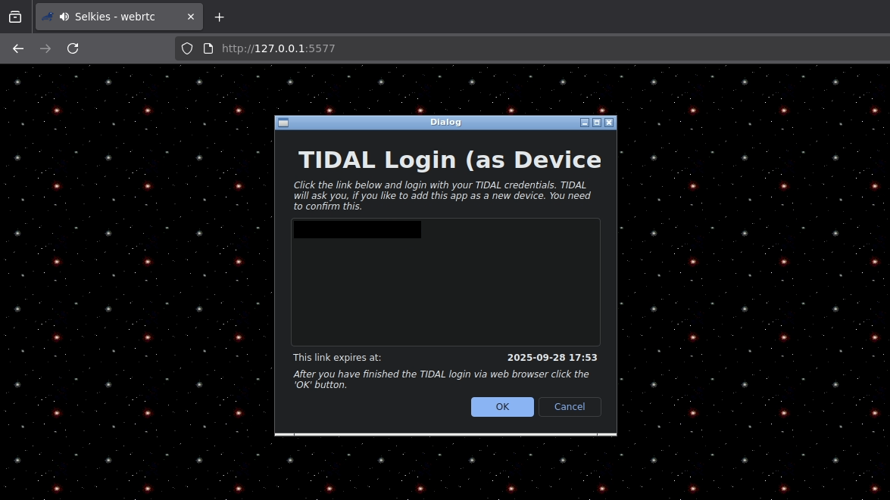

# tidal-dl-ng-selkies

Docker container to run [tidal-dl-ng](https://github.com/exislow/tidal-dl-ng) and stream the gui to web browser using selkies.



## Docker Compose
Create example `.env` file:
```bash
TIDALDL_PASS=changeme # openssl rand -hex 15
TIDALDL_ID=1001 # id of user for PUID
MEDIA_ID=1001 # id of group for PGID
```
example `docker-compose.yml`:
```yml
services:
  tidal-dl:
    image: example.com/gooberlogic/tidal-dl-ng-selkies:latest
    container_name: tidal-dl
    restart: no
    environment:
      - WEBUI_USER=admin
      - WEBUI_PASS=${TIDALDL_PASS}
      - PUID=${TIDALDL_ID}
      - PGID=${MEDIA_ID}
    ports:
      - "5578:5578/tcp"
    volumes:
      - "./tidal-dl/config:/data"
      - "./media/music:/music"
      # alternate case
      #- "./media/music:/music/music"
      #- "./media/music_videos:/music/music_videos"
```
#### Notices
- Close the update prompt that shows up.

- Audio is in a unbearable state, disable in selkies.

- These paths are symlinked within the container:

  - `/data -> /home/xyz/.config/tidal_dl_ng`

  - `/music -> /home/xyz/download`

#### Preferences
Example tidal-dl-ng preferences:
```
download_base_path: ~/download
format_track: Tracks/{album_artist}/{album_title}/CD {track_volume_num_optional} - {album_track_num}. {artist_name} - {track_title} {track_explicit}
format_album: {album_artist}/{album_title} {album_explicit}/CD {track_volume_num_optional} - {album_track_num}. {artist_name} - {track_title} {track_explicit}
path_binary_ffmpeg: /usr/bin/ffmpeg
```

#### Environment Variables

| Variable | Default Value | Description |
| -------- | ------------- | ----------- |
| `WEBUI_PORT` | `5578` | port of the selkies frontend |
| `WEBUI_USER` | `admin` | username to frontend |
| `WEBUI_PASS` | `changeme` | password to frontend |
| `PUID` | `1001` | process user ID of selkies and nginx |
| `PGID` | `1001` | process group ID of selkies and nginx |
| `CHMOD_FILE` | `770` | chmod override of files in `/data` and `/music` |
| `CHMOD_DIR` | `771` | chmod override of dirs in `/data` and `/music` |
| `SELKIES_PORT` | `5577` | port of the selkies websocket |

There are more variables provided in `Dockerfile` and selkies documentation.
